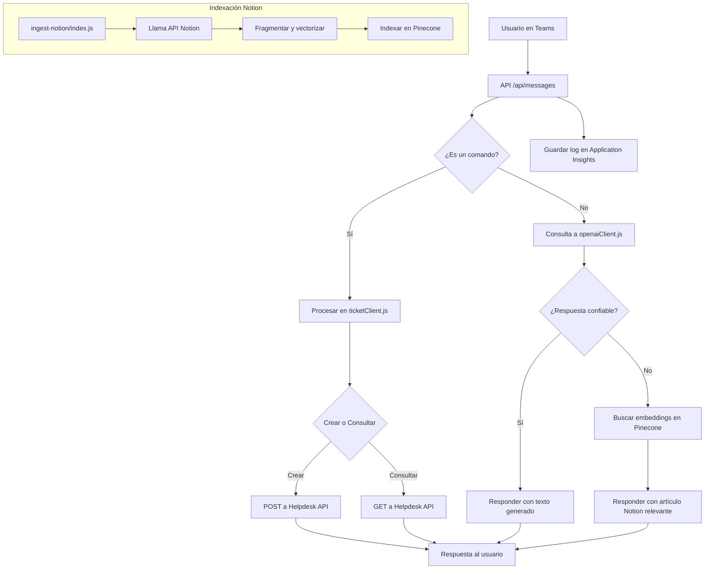

# 🤖 OrbIT Bot para Microsoft Teams — Documentación Técnica Completa

OrbIT es un bot corporativo desarrollado por **Newlink** que centraliza la gestión de soporte técnico, documentación y automatización interna directamente desde **Microsoft Teams**, combinando inteligencia artificial, integración con sistemas de tickets y una interfaz de usuario personalizada mediante un **tab React**.

---

## 📂 Estructura del Repositorio

```
TeamsBot/
├── bot.js                  # Entrada principal del bot de Teams
├── openaiClient.js         # Cliente de GPT (Azure OpenAI)
├── retrievalClient.js      # Búsqueda semántica sobre documentación indexada
├── ticketClient.js         # Cliente REST para Helpdesk interno
├── api-messages/           # API para procesamiento de mensajes entrantes
├── api-tabs/               # API del tab personalizado de Teams
├── api-tickets/            # API pública RESTful para manejar tickets
├── ingest-notion/          # Proceso de indexación periódica de contenido Notion
├── tabs-portal/            # App React embebida como pestaña (tab)
├── teams-tab/              # Configuración de Teams para servir el tab
├── package.json            # Configuración del entorno y dependencias
└── .env                    # Variables sensibles y tokens
```

---

## 🚀 Funcionalidades Clave

### 🧠 IA y Automatización
- Respuesta automática a preguntas técnicas y operativas (OpenAI GPT-4o)
- Análisis semántico con fallback a embeddings (documentos internos)

### 🎫 Integración con Helpdesk
- Crear, consultar y escalar tickets desde Microsoft Teams
- Autenticación integrada con Azure AD
- Conexión segura a plataforma Helpdesk de Newlink

### 📚 Indexación desde Notion (`ingest-notion/`)
- Se conecta a la API oficial de Notion con un token seguro
- Extrae artículos, documentos, procedimientos técnicos
- Los transforma a chunks y los indexa en Pinecone para búsquedas vectoriales

### 🌐 APIs HTTP (Triggers)
- `/api/messages`: punto de entrada principal del bot
- `/api/tickets`: operaciones de alta/baja/consulta de tickets
- `/api/tabs`: contenido dinámico del tab
- `/api/keepalive`: para ping de disponibilidad

### 🧾 Tab Personalizado (React)
- Formulario interactivo para crear tickets
- Listado de solicitudes abiertas
- Artículos sugeridos dinámicamente

---

## ⚙️ Instalación Paso a Paso

### Requisitos
- Node.js ≥ 18.17.0
- Cuenta de Azure y App Registration
- API Keys: Notion, Azure OpenAI, Pinecone

### Back-end

```bash
git clone https://github.com/NewlinkG/TeamsBot.git
cd TeamsBot
npm install
```

### Front-end del Tab

```bash
npx create-react-app teams-tab
cd tabs-portal
npm install @microsoft/teams-js axios
npm run build
xcopy.exe .\build\* ..\teams-tab\ /S
```

---

## 🔧 Variables de Entorno Importantes

Archivo `.env` en la raíz (ver contenido completo en documento previo). Variables clave incluyen:

- `MicrosoftAppId`, `MicrosoftAppPassword`
- `HELPDESK_API_URL`, `HELPDESK_API_KEY`
- `AZURE_OPENAI_ENDPOINT`, `AZURE_OPENAI_KEY`
- `NOTION_TOKEN`, `PINECONE_API_KEY`

---

## 🔁 Diagrama de Flujo Técnico



---

## 🧩 Descripción de Componentes Técnicos

### `bot.js`
- Extiende `TeamsActivityHandler`
- Orquestra el enrutamiento de mensajes hacia los módulos internos

### `openaiClient.js`
- Usa GPT-4o de Azure para generación de texto
- Considera contexto e historial por usuario

### `retrievalClient.js`
- Ejecuta embedding y búsqueda vectorial
- Requiere Pinecone o similar

### `ticketClient.js`
- CRUD de tickets con Helpdesk
- Encapsula autenticación, errores y validación

### `ingest-notion/`
- Correr como cronjob
- Indexa nuevos artículos, detecta cambios y los sincroniza

### `api-messages/`, `api-tabs/`, `api-tickets/`
- HTTP triggers (Azure / Express)
- Sirven como puntos de entrada RESTful al sistema

### `tabs-portal/`
- React app con Vite
- Diseño responsivo integrado a Teams
- Utiliza Azure Storage para hosting estático

---

## ✅ Buenas Prácticas y Seguridad

- Tokens y secretos solo en `.env`
- Logs en Application Insights
- Validación de entradas y sanitización de prompt
- OAuth2 recomendado para extensiones futuras

---

## 🛠️ CI/CD Sugerido

- GitHub Actions para testing + deploy
- Envío a Azure Web App (bot + APIs)
- `tabs-portal/` build + upload a Azure Storage Blob

---

## 📬 Soporte

Para soporte técnico: [help@newlink-group.com](mailto:help@newlink-group.com)